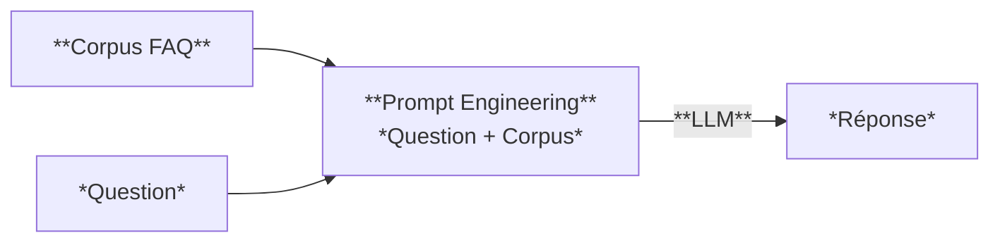
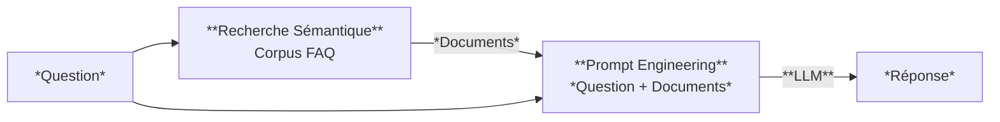
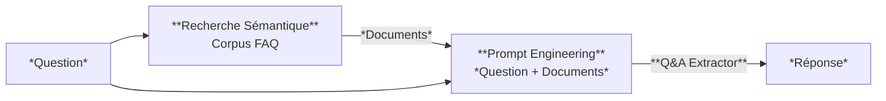

# Note de Cadrage - Projet FAQ Intelligent

**Étudiant(s)** : Steve Dos Santos, Jonathan Caillaux

**Date** : 12/01/2026

**Version** : 1.0

---

## 1. Contexte et objectifs

### 1.1 Contexte du projet

La **Communauté de Communes Val de Loire Numérique** a solicité ***DataPublic Solutions*** dans le but de moderniser sa plateforme de service citoyen en mettant en place une solution IA permettant d'automatiser la réponse sur de démarches administratives (état civil, urbanisme, déchets, transports...)

La mise en place de cet assistant intelligent à pour but principale d'alléger considérablement la charger de travail des agents municipaux actuellement en charge d'effectuer ce travail.

La solution IA sera exposé via une API REST ce qui facilitera son intégration au site web de la collectivité existant.

### 1.2 Objectifs du projet

**Objectif principal** :
Concevoir, développer et déployer une API d'assistance FAQ intégrant un LLM, en suivant une démarche rigoureuse et stratégique pour déterminer l'approche technique la plus adaptée.

**Objectifs secondaires** :

1. **Benchmark** : Effectuer un travail de veille technique pour identifier les différentes solutions IA ainsi qu'un protocole de benchmark. 

2. **Recommandation** : Choix de la solution technique 
3. **Implémentation** : Développement de la solution IA 
4. **Industrialisation** : Mise en place des tests automatisés et pipeline CI/CD
5. **Documentation** : Produire une documentation technique exploitable

### 1.3 Périmètre

**Dans le périmètre** :

Un assistant intelligent doit être mis en place afin d'automatiser la réponse aux questions de citoyens concernant les catégories suivante :

* État civil
* Urbanisme
* Déchets environnement
* Transports
* Petite-enfance
* Social solidarité
* Vie associative
* Élections
* Logement
* Culture_sport
* Fiscalité
* Eau assainissement

Pour cela un service d'IA sera exposé par un back-end de type API REST développé en Python 3.10+. Des outils de monitoring d'application seront mis en place afin de contrôler la bonne santé du service IA ainsi que des différentes infrastructures mises en jeu.

**Hors périmètre** :

Afin de palier à d'éventuelles contraintes budgétaire et de violation de la protection des données, aucune solution propriétaire (OpenAI, Anthropic, ...) ou de type cloud (Google Cloud, AWS, Azure...) ne sera retenue.  Bien que la priorité soit le développement d'une solution back-end (API REST) pour l'exposition du service IA, une solution front-end de type application web sera développée à des fins de démonstration. En revanche aucun framework python (Streamlit, Gradio, Taïpy) ne sera sélectioné.

---

## 2. Compréhension des 3 stratégies

### 2.1 Stratégie A - LLM seul

**Principe** :
Cette stratégie consiste à utiliser l'ensemble de la FAQ en en contexte à un LLM pour rédiger une réponse.

**Avantages attendus** :

- Simplicité 

**Inconvénients attendus** :
- Tous l'ensemble de la FAQ doit figurer dans le contexte 
- Ne scale pas
- Les informations nécessaires pour répondre à la question peuvent être noyés 
- Hallucinations potentielles du à l'IA 

**Schéma simplifié** :

### 2.2 Stratégie B - Q&A générative

**Principe** :
Cette approche est aussi appelée Q&A génératif. Elle consiste à effectuer une recherche sémantique pour identifier les documents ayant un contenu sémantique proche de la question posée, i.e. les documents les plus susceptibles de contenir la réponse à la question posée. Ensuite, ces documents ainsi que la question sont fournis à un LLM qui génère une réponse.

**Avantages attendus** :

- Allègement du contexte LLM (les informations sont filtrées)
- Minimisation du risque d’hallucination

**Inconvénients attendus** :

- Hallucinations potentielles
- Mise à jour de la FAQ moins trivial

**Schéma simplifié** :

### 2.3 Stratégie C - Q&A extractif

**Principe** :
Cette approche consiste à effectuer une recherche sémantique pour identifier les documents ayant un contenu sémantique proche de la question posée, i.e. les documents les plus susceptibles de contenir la réponse à la question posée. Ensuite, ces documents sont donnés en tant que contexte à un modèle de type Q&A extractif pour extraire la réponse à la question depuis le contexte fourni par la recherche sémantique.

**Avantages attendus** :
- Allègement du contexte LLM (les informations sont filtrées)
- Pas d'hallucinations

**Inconvénients attendus** :

- Mise à jour de la FAQ moins trivial
- Réponse pas rédigée

**Schéma simplifié** :

---

## 3. Stack technique envisagée

### 3.1 Composants principaux

| Composant | Technologie choisie | Justification |
|-----------|---------------------|---------------|
| Langage | Python 3.10+ | Version compatible avec la plupart des framework IA. Mise à jour de sécurité toujours en vigueur. |
| Framework API | FastAPI | Framework python pour API REST léger avec documentation automatique. Référence standard pour la construction d'API REST de qualité industrielle. |
| LLM | Hugginface inference API | Permet l'abstraction d'API de plusieurs fournisseurs. Facilite les stratégies de changement de modèle.Uniformisation du chiffrement des potentiels coûts d'utilisation |
| Embeddings | Sentence Transformer | Référence HF spécialisé dans l'utilisation de transformer. API simple et unifié avec 18K+ modèles disponible. |
| Tests | Pytest | Framework robuste de tests automatisé (test unitaires et fonctionnel) |
| CI/CD | GitHub action | Le déploiement peut facilement être conditionné par le résultat des tests automatisés limitant les risques de régression. Interopérabilité avec git. |

### 3.2 Modèles IA identifiés

| Usage | Modèle | Source | Raison du choix |
|-------|--------|--------|-----------------|
| LLM (génération) | Mistral 7B | HuggingFace | Modèle open source et Français(possibilité d'utilisation en locale). |
| Embeddings | Sentence Transformer/paraphrase-multilingual-MiniLM-L12-v2 | Huggingface | Périmètre d'action suffisamment restreint pour utiliser des embeddings d'une taille relativement petite (384) et d'utiliser une solution locale. |
| Q&A extractif | [mdeberta-v3-base-squad2](https://huggingface.co/timpal0l/mdeberta-v3-base-squad2) | Huggingface | Top leaderboard HF. Modèle léger et français. Bonus : modèle multi-langues. |

---

## 4. Planning prévisionnel

| Jour | Phase | Objectifs | Livrables |
|------|-------|-----------|-----------|
| J1 | Étude | Comprendre les différentes stratégies ainsi que |  |
| J2 | Étude | Rédaction rapport veille et note de cadrage | Note de cadrage, rapport de veille |
| J3 | Benchmark | Implémentation des benchmarks et validation de la stratégie optimale | |
| J4 | Benchmark | Implémentation des benchmarks et validation de la stratégie optimale | Rapport de benchmark et recommandation |
| J5 | Benchmark | Rapport de benchmark et recommandation | Rapport de benchmark et recommandation |
| J6 | Implémentation | Exposition de la stratégie via une API REST. | |
| J7 | Implémentation | Mise en place des tests automatisés et monitoring d'application | |
| J8 | Implémentation | Front-end minimaliste incluant un feedback utilisateur pour la démonstration | |
| J9 | Implémentation | Documentation et rapport de projet | Solution fonctionnelle |
| J10 | Démonstration et Livraison client | Démonstration et livraison du produit final | Solution fonctionnelle |

---

## 5. Risques identifiés

| Risque | Probabilité | Impact | Mitigation |
|--------|-------------|--------|------------|
| API HuggingFace indisponible | < 0.0003 | Stratégies A et B hors service. | Solutions alternative utiliser l'API mistral directement. |
| Temps d'inférence anormalement long |  | Toutes les stratégies sont impactées | Monitoring API et infrastructure pour identification des causes |
| Mise à jour des modèles exposée via l'API HF | Probable | Dégradation potentielle des performances de la solution IA | Suivi régulier des version de modèles exposé, monitoring du feedback utilisateur ou utilisation d'un LLM local. |
| Discontinuité de service HF | Très Faible | Un arrêt des services HF contraint une refonte de la solution IA | HF est la plateforme la plus populaire possédant une base utilisateurs importantes et en pleine croissance. Ce risque est probablement négligeable. |

---

## 6. Questions en suspens

Aucune information sur les infrastructures disponibles ni sur le trafic API attendu. 

* L'utilisation d'une solution locale est-elle réellement moins onéreuse qu'une solution Cloud (coût de maintenance vs utilisation API) ?
* Soucis de scalabilité impossible a anticipé.

---

## 7. Ressources consultées

*Rapport de veille annexé.* 
