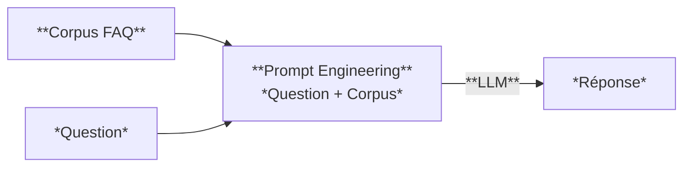
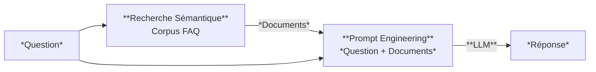
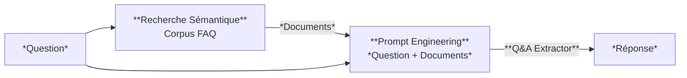

# Note de Cadrage - Projet FAQ Intelligent

**Étudiant(s)** : Steve Dos Santos, Jonathan Caillaux

**Date** : 12/01/2026

**Version** : 1.0

---

## 1. Contexte et objectifs

### 1.1 Contexte du projet

La Communauté de Communes Val de Loire Numérique a solicité ***DataPublic Solutions*** dans le but de moderniser sa plateforme de service citoyen en mettant en place une solution IA permettant d'automatiser 

Vous êtes développeur·se IA au sein de ***DataPublic Solutions***, une entreprise spécialisée dans la transformation numérique des collectivités territoriales.

La ***Communauté de Communes Val de Loire Numérique*** vous sollicite pour moderniser son service d'accueil citoyen. Actuellement, les agents passent 60% de leur temps à répondre aux mêmes questions récurrentes sur les démarches administratives (état civil, urbanisme, déchets, transports...).

Le client souhaite mettre en place un ***assistant intelligent*** capable de répondre automatiquement aux questions des citoyens, accessible via une API REST qui sera ensuite intégrée au site web de la collectivité.

### 1.2 Objectifs du projet

**Objectif principal** :
Concevoir, développer et déployer une API d'assistance FAQ intégrant un LLM, en suivant une démarche rigoureuse et stratégique pour déterminer l'approche technique la plus adaptée.

**Objectifs secondaires** :

1. **Benchmark** : Effectuer un travail de veille technique pour identifier les différentes solutions IA ainsi qu'un protocol de benchmark. 

2. **Recommandation** : Choix de la solution technique 
3. **Implémentation** : Développement de la solution IA 
4. **Industrialisation** : Mise en place des tests automatisés et pipeline CI/CD
5. **Documentation** : Produire une documentation technique exploitable

### 1.3 Périmètre

**Dans le périmètre** :

Un assistant intelligent doit être mis en place afin d'automatiser la réponse aux questions de citoyens concernant les catégories suivante :

* État civil
* Urbanisme
* Déchets environnement
* Transports
* Petite-enfance
* Social solidarité
* Vie associative
* Élections
* Logement
* Culture_sport
* Fiscalité
* Eau assainissement

Pour cela un service d'IA sera exposé par un back-end de type API REST développé en Python 3.10+. Des outils de monitoring d'application seront mis en place afin de contrôler la bonne santé du service IA ainsi que des différentes infrastructures mises en jeu.

**Hors périmètre** :

Afin de palier à d'éventuelles contraintes budgétaire et de violation de la protection des données, aucune solution propriétaire (OpenAI, Anthropic, ...) ou de type cloud (Google Cloud, AWS, Azure...) ne sera retenue.  Bien que la priorité soit le développement d'une solution back-end (API REST) pour l'exposition du service IA, une solution front-end de type application web sera développée à des fins de démonstration. En revanche aucun framework python (Streamlit, Gradio, Taïpaï) ne sera sélectioné.

---

## 2. Compréhension des 3 stratégies

### 2.1 Stratégie A - LLM seul

**Principe** :
Cette stratégie consiste à utiliser un LLM pour rédiger une réponse en donnant

**Avantages attendus** :

- 

**Inconvénients attendus** :
- 

**Schéma simplifié** :

### 2.2 Stratégie B - Q&A générative

**Principe** :
Cette approche est aussi appelée Q&A génératif**/**RAG. Elle consiste à effectuer une recherche sémantique pour identifier les documents ayant un contenu sémantique proche de la question posée, i.e. les documents les plus susceptibles de contenir la réponse à la question posée. Ensuite, ces documents ainsi que la question sont fournis à un LLM qui génère une réponse.

**Avantages attendus** :

- 

**Inconvénients attendus** :
- 

**Schéma simplifié** :

### 2.3 Stratégie C - Q&A extractif

**Principe** :
Cette approche consiste à effectuer une recherche sémantique pour identifier les documents ayant un contenu sémantique proche de la question posée, i.e. les documents les plus susceptibles de contenir la réponse à la question posée. Ensuite**,** ces documents sont donnés en tant que contexte à un modèle de type Q&A extractif pour extraire la réponse à la question depuis le contexte fourn**i** par la recherche sémantique.

**Avantages attendus** :
- 

**Inconvénients attendus** :
- 

**Schéma simplifié** :

---

## 3. Stack technique envisagée

### 3.1 Composants principaux

| Composant | Technologie choisie | Justification |
|-----------|---------------------|---------------|
| Langage | Python 3.10+ | |
| Framework API | | |
| LLM | | |
| Embeddings | | |
| Tests | | |
| CI/CD | | |

### 3.2 Modèles IA identifiés

| Usage | Modèle | Source | Raison du choix |
|-------|--------|--------|-----------------|
| LLM (génération) | | HuggingFace | |
| Embeddings | | | |
| Q&A extractif | | | |

---

## 4. Planning prévisionnel

| Jour | Phase | Objectifs | Livrables |
|------|-------|-----------|-----------|
| J1 | | | |
| J2 | | | |
| J3 | | | |
| J4 | | | |
| J5 | | | |
| J6 | | | |
| J7 | | | |
| J8 | | | |
| J9 | | | |
| J10 | | | |

---

## 5. Risques identifiés

| Risque | Probabilité | Impact | Mitigation |
|--------|-------------|--------|------------|
| API HuggingFace indisponible | | | |
| Temps insuffisant pour X | | | |
| [Autre risque] | | | |

---

## 6. Questions en suspens

- [ ] [Question 1 pour le formateur]
- [ ] [Question 2]

---

## 7. Ressources consultées (Veille J1)

| Source | URL | Pertinence | Notes |
|--------|-----|------------|-------|
| | | | |
| | | | |

---
